# Debug Library for Robot Framework

- [Introduction](#introduction)
- [Installation](#installation)
- [Usage](#usage)
    - [REPL mode](#repl-mode)
    - [Library mode](#library-mode)
    - [Listener mode](#listener-mode)
    - [Step debugging](#step-debugging)
- [Overview of commands](#overview-of-commands)
- [Submitting issues](#submitting-issues)
- [Development](#development)
- [License](#license)

## Introduction

This library is a fork by René Rohner from the original robotframework-debuglibrary by Xie Yanbo.

Robotframework-RobotDebug is a debug library for [RobotFramework](https://robotframework.org),
which can be used as an interactive shell(REPL) and listener also.

## Installation

To install using `pip`:

    pip install robotframework-debug

## Usage

You can use RobotDebug library in 3 different modes:  
- REPL mode,  
- Library mode,  
- Listener mode.  

### REPL mode

Just call `irobot` in the terminal with all available robot arguments. An interactive shell will open. To exit use the command `exit` or shortcut `Ctrl+D`.    
It is possible to evaluate both single-line and multi-line expressions. 

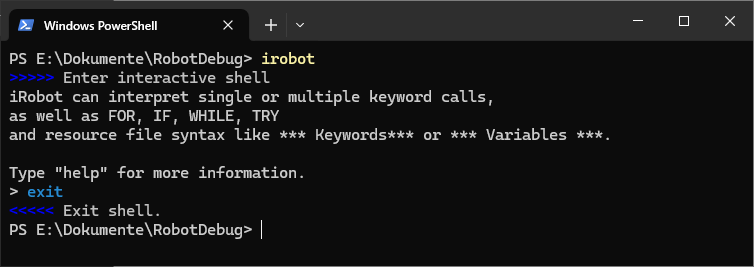

- you can execute keywords and define variables

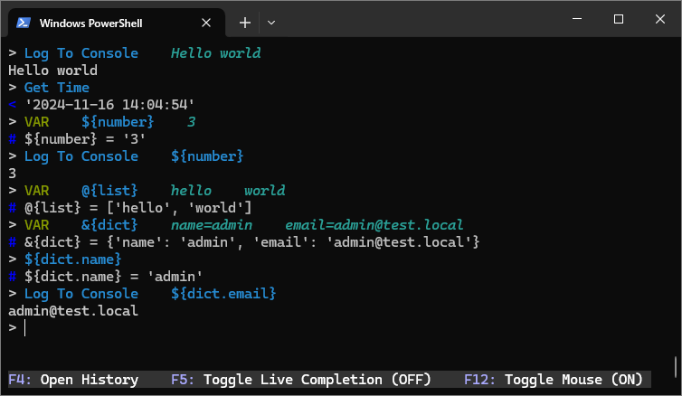

- You can set a variable and use this variable in another keyword in one step. Use the keyboard shortcut `Shift + Down Arrow` to go to the next line without evaluating the first line. Then press the `Enter` key twice to evaluate expressions.

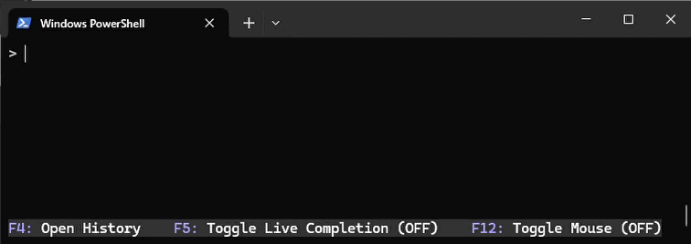

- `irobot` can evaluate multi line expressions as `FOR` and `WHILE` loops, `IF / ELSE` statements and `TRY / EXCEPT` expressions.

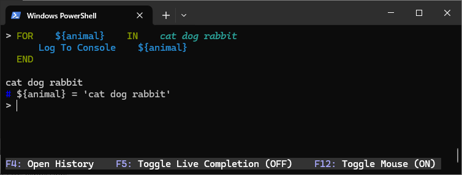

- you can import libraries, resources and variable files

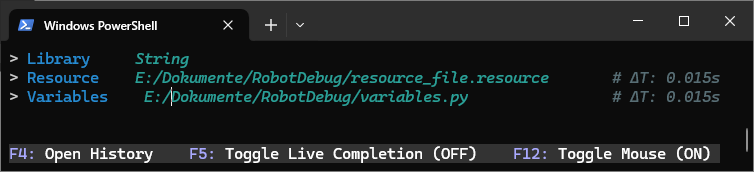 

- you can use the resource file syntax like `*** Settings *** `, `*** Variables ***` and `*** Keywords ***` and write the resource file directly into the irobot shell. Press the `Enter` key twice to import your resource.

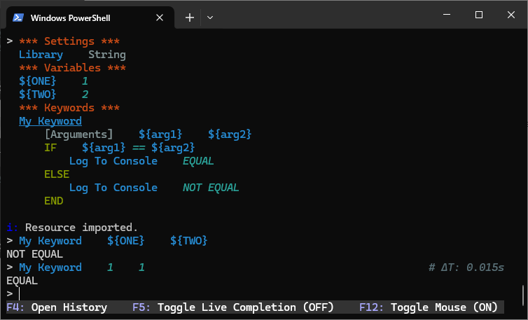

### Library mode

Import `RobotDebug` as library and use the `Debug` keyword to set a breakpoint in your test cases:

    *** Settings ***
    Library         RobotDebug

    *** Test Cases ***
    Some Test
        # some keywords...
        Debug
        # some else...

The `Debug` keyword pauses test execution and opens an interactive shell. Then you can evaluate expressions, try out keywords, inspect the variables and trace and view the code step by step. See also the section [step debugging](#step-debugging).

### Listener mode

You can attach it as a listener and run your test until it fails. Just add `--listener RobotDebug.Listener` to you `robot` call.

    robot --listener RobotDebug.Listener some.robot

If your test case fails, RobotDebug will stop there and the interactive shell will be opened at that point. Then you can try out keywords and analyze the issue.

https://github.com/user-attachments/assets/18c48b1c-e870-45fd-ad67-f0424e88f172

### Step debugging

RobotDebug supports step debugging in Library and Listner mode.  

Use keys *F7 (INTO)*, *F8 (OVER)* and *F9 (OUT)* to trace and view the code step by step.

*F7: INTO*  
The `F7` key allows you to go into the keyword if it contains further keywords inside. The first line within the user keyword is executed and the execution is paused again.

*F8: OVER*  
The `F8` key allows you to execute the current line completely in one step, even if it contains other keywords inside.

*F9: OUT*  
You can use the `F9` key to exit the keyword if you have entered it previously.

*F10: CONTINUE*  
You can use the `F10` key or the `continue` or `c` command to continue execution until the next `Debug` keyword if you use this in library mode or the next failure of the test if you use this in listner mode.

*SHIFT TAB: DETACH*  
`Shift Tab` allows you to run the rest of the test case to the end without opening the interactive shell.

*List*  
The commands `list` or `l` and `ll` display the test case snippet including the line being executed:  
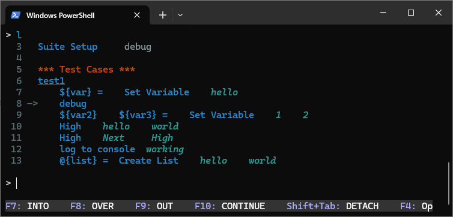
 
### Overview of commands

Use `exit` or keys `Ctrl+D` to exit the interactive shell.

Use `clear` or `cls` to clear the screen.

The interactive shell supports auto-completion for robotframework keywords and commands. Try input BuiltIn. then hit `Control + Space` key to feel it.   

You can use the `F5` key to enable or disable live completion.  
Live completion ON:  
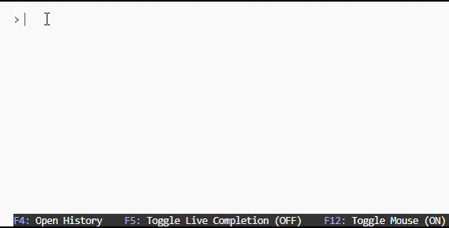

You can use the `F12` key to enable or disable mouse support within the shell.  
Mouse support ON:  
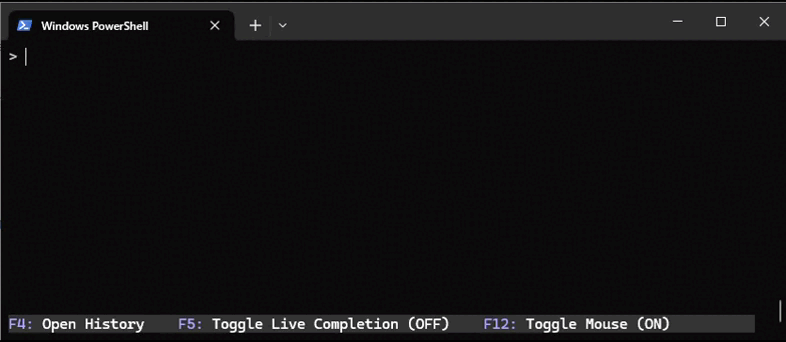  
To be able to scroll, disable mouse support.

You can use the command `history` or key `F4` to view the history in your irobot shell. You can see used keywords and commands on the left and imported resources on the right side.  
Use `TAB` to switch focus from one part to another. To close history, press key `F4`.

https://github.com/user-attachments/assets/cfa2b7c7-a2eb-4063-b1c4-30bff48da850

The history will save at `~/.rfdebug_history` located in user home directory default or any path defined in the environment variable RFDEBUG_HISTORY.

Use `help` to view possible commands:  

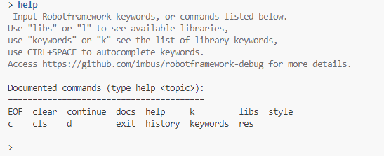

To import a library, use  `Library    <lib_name>`. 
To show all imported Libraries, use `libs` and to show sources for each library, use `libs -s`.
 
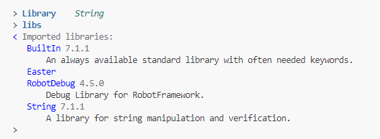

The command `res` lists the imported resource files.
`res -s` lists the imported resources files with source: 

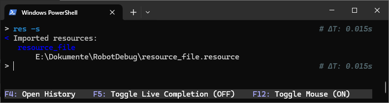

The command `keywords` or `k` lists all keywords of imported libraries.  
The command `keywords <lib_name>` lists keywords of a specified library.

To get keyword documentation for individual keywords, use `docs <keyword_name>` or `d <keyword_name>`: 

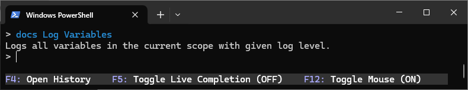

## Submitting issues

Bugs and enhancements are tracked in the [issue tracker](https://github.com/imbus/robotframework-debug/issues).

Before submitting a new issue, it is always a good idea to check if the same bug or enhancement already been reported. If it is, please add your comments to the existing issue instead of creating a new one.

## Development

If you want to develop and run RobotDebug locally, you can use

    $ python RobotDebug/shell.py tests/step.robot

shell.py is calling robot through a child process, so it will interrupt python debugging capabilities. If you want to debug in tools like vscode, pdb, you should run

    $ python -m robot tests/step.robot

If you want to run the test, please install the dependency packages first and then execute the test

    $ python setup.py develop
    $ python setup.py test

Since RF takes over stdout, debugging information can be output with

    import sys
    print('some information', file=sys.stdout)

## License

This software is licensed under the `New BSD License`. See the `LICENSE` file in the top distribution directory for the full license text.
