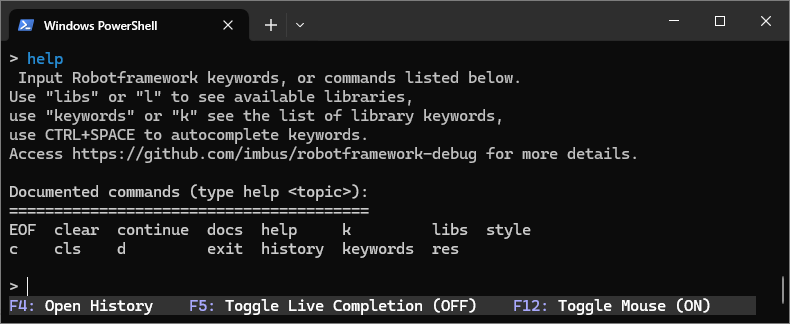

# Debug Library for Robot Framework

- [Introduction](#introduction)
- [Installation](#installation)
- [Usage](#usage)
    - [Debug keyword](#debug-keyword)
    - [Irobot shell](#irobot-shell)
    - [Overview of commands](#overview-of-commands)
    - [Single line expression evaluation](#single-line-expression-evaluation)
    - [Multi line expression evaluation](#multi-line-expression-evaluation)
    - [Step debugging](#step-debugging)
    - [RobotDebug.Listener](#RobotDebug.Listener)
- [Submitting issues](#submitting-issues)
- [Development](#development)
- [License](#license)

## Introduction

This library is a fork by René Rohner from the original robotframework-debuglibrary by Xie Yanbo

Robotframework-RobotDebug is a debug library for [RobotFramework](https://robotframework.org),
which can be used as an interactive shell(REPL) also.

## Installation

To install using `pip`:

    pip install robotframework-debug

## Usage

### Debug keyword
You can use this as a library, import `RobotDebug` and call `Debug` keyword in your test files like this:

    *** Settings ***
    Library         RobotDebug

    *** Test Cases ***
    Some Test
        # some keywords...
        Debug
        # some else...

`Debug` keyword pauses the test execution and opens an interactive shell. Within the shell you can evaluate expressions, inspect the variables and keywords. See also the section [step debugging](#step-debugging).

### Irobot shell

Another option is to open an interactive shell in standalone mode.
To start, type `irobot`:

### Overview of commands

Use `help` to view possible commands:  

Use `exit` or keys `Ctrl+D` to exit the interactive shell.

To import library, use  `Library    <lib_name>`. 
To show all imported Libraries, use `libs` and to show sources for each library, use `libs -s`.
 

It is possible to import resource and variable files:

    > Resource    path_to_resource/resource.resource
    > Variables    path_to_variablesfile/variables.py

The command `res` lists the imported resources files.
`res -s` lists the imported resources files with source: 

The command `keywords` or `k` lists all keywords of imported libraries.  
And the command `keywords <lib_name>` lists keywords of a specified library.

To get keyword documentation for individual keywords, use `docs <keyword_name>` or `d <keyword_name>`: 

The history be saved at `~/.rfdebug_history` located in user home directory default or any path defined in environment variable RFDEBUG_HISTORY.

You can use the command `history` or key `F4` to view the history in your irobot shell. You can see used keywords and commands on the left and imported resources on the right side.  
Use `TAB` to switch focus from one part to another. To close history, press key `F4`.

The interactive shell support auto-completion for robotframework keywords and commands. Try input BuiltIn. then hit `Control + Space` key to feeling it.   
You can use the `F5` key to enable or disable live completion.

Live completion ON:

You can use the `F12` key to enable or disable mouse support within shell.

`irobot` accept any robot arguments, but by default, `rfdebug` disabled all logs with `-l None -x None -o None -L None -r None`.

### Single line expression evaluation

You can execute commands and define variables:  

### Multi line expression evaluation  

You can write the resource file directly into the shell:

`irobot`  can evaluate multi line expressions as `FOR` and `WHILE` loops, `IF / ELSE` statements and `TRY / EXCEPT` expressions.

### Step debugging

If you use RobotDebug as a library with `Debug` keyword, you can use keys *F7 (INTO)*, *F8 (OVER)* and *F9 (OUT)* to trace and view the code step by step.

*F7: INTO*  
The `F7` key allows you to go into the keyword if it contains further keywords inside. The first line within the user keyword is executed and the execution is paused again.

*F8: OVER*  
The `F8` key allows you to execute the current line completely in one step, even if it contains other keywords inside.

*F9: OUT*  
You can use the `F9` key to exit the keyword if you have entered it previously.

*F10: CONTINUE*  
You can use the `F10` key or the `continue` command to continue execution until the next `Debug` keyword.

*SHIFT TAB: DETACH*  
`Shift Tab` allows you to run the rest of the test case to the end and ingnores `Debug` keyword.

*List*  
The command `list` or `l` displays the test case snippet including the line being executed:  

### RobotDebug.Listener

You can start your test cases with RobotDebug.Listener:

    robot --listener RobotDebug.Listener some.robot

The listener listens to the failure. If the test case fails, the interactive shell is opened at this point.  

## Submitting issues

Bugs and enhancements are tracked in the [issue tracker](https://github.com/imbus/robotframework-debug/issues).

Before submitting a new issue, it is always a good idea to check is the same bug or enhancement already reported. If it is, please add your comments to the existing issue instead of creating a new one.

## Development

If you want to develop and run RobotDebug locally, you can use

    $ python RobotDebug/shell.py tests/step.robot

shell.py is calling robot through a child process, so it will interrupt python debugging capabilities. If you want to debug in tools like vscode, pdb, you should run

    $ python -m robot tests/step.robot

If you want to run the test, please install the dependency packages first and then execute the test

    $ python setup.py develop
    $ python setup.py test

Since RF takes over stdout, debugging information can be output with

    import sys
    print('some information', file=sys.stdout)

## License

This software is licensed under the `New BSD License`. See the `LICENSE` file in the top distribution directory for the full license text.