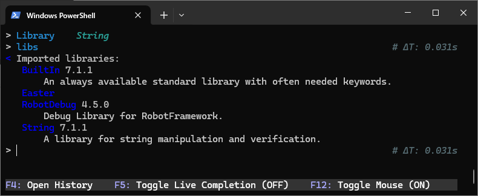
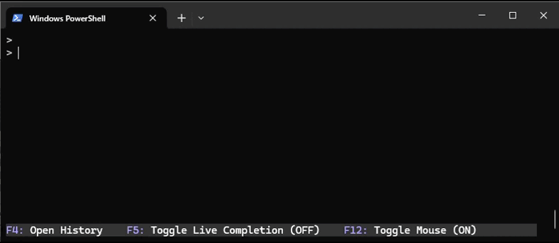

# Debug Library for Robot Framework

- [Introduction](#introduction)
- [Installation](#installation)
- [Usage](#usage)
    - [Overview of commands](#overview-of-commands)
    - [Single line expression evaluation](#single-line-expression-evaluation)
    - [Multi line expression evaluation](#multi-line-expression-evaluation)
    - [Step debugging](#step-debugging)
- [Submitting issues](#submitting-issues)
- [Development](#development)
- [License](#license)

## Introduction

This Library is a Fork by René Rohner from the original robotframework-debuglibrary by Xie Yanbo

Robotframework-RobotDebug is a debug library for [RobotFramework](https://robotframework.org),
which can be used as an interactive shell(REPL) also.

## Installation

To install using `pip`:

    pip install robotframework-debug

## Usage

You can use this as a library, import `RobotDebug` and call `Debug` keyword in your test files like this:

    *** Settings ***
    Library         RobotDebug

    *** Test Cases ***
    Some Test
        # some keywords...
        Debug
        # some else...
        ${count} =  Get Element Count  name:div_name

The test case will be executed until `Debug`, then the interactive shell will be opened. You can evaluate different expressions in the shell. When you exit the shell, the test steps in the test case after `Debug` are executed.

Or you can run it standalone as a RobotFramework shell.  
To start, type `irobot`:

### Overview of commands

Use `help` to view possible commands:  

Use `exit` or keys `Ctrl+D` to exit the interactive shell.

Use key `Arrow Right` to autocomplete keywords.

To import library, use  `Library    <lib_name>`.  
The command `libs` lists the imported and built.in libraries and `libs -s` lists the libraries with source:  

It is also possible to import resource and variable files:

    > Resource    path_to_resource/resource.resource
    > Variables    path_to_variablesfile/variables.py

The command `res` lists the imported resources files.
`res -s` lists the imported resource file with source: 

The command `keywords` or `k` lists all keywords of imported libraries.  
And the command `keywords <lib_name>` lists keywords of a specified library.

To view the documentation of a keyword, use `docs <keyword_name>` or `d <keyword_name>`:

The history will save at ~/.rfdebug_history in user home directory default or any file defined in environment variable RFDEBUG_HISTORY.

You can use the command `history` or key `F4` to view the history in a shell. You will see used keywords and commands on the left side of a shell and imported resources on the right. Use `TAB` to switch focus from one part to another. To close history, press key `F4`.

Using key `F5` you can activate or deactivate live completion.

Live completion ON:

`irobot` accept any robot arguments, but by default, `rfdebug` disabled all logs with `-l None -x None -o None -L None -r None`.

### Single line expression evaluation

You can execute command and define variables:  

### Multi line expression evaluation  

You can write the resource file directly in the shell:

`irobot`  can evaluate multi line expressions as `FOR` and `WHILE` loops, `IF / ELSE` statements and `TRY / EXCEPT` expressions.

### Step debugging

TODO

## Submitting issues

Bugs and enhancements are tracked in the [issue tracker](https://github.com/imbus/robotframework-debug/issues).

Before submitting a new issue, it is always a good idea to check is the same bug or enhancement already reported. If it is, please add your comments to the existing issue instead of creating a new one.

## Development

If you want to develop and run RobotDebug locally, you can use

    $ python RobotDebug/shell.py tests/step.robot

shell.py is calling robot through a child process, so it will interrupt python debugging capabilities. If you want to debug in tools like vscode, pdb, you should run

    $ python -m robot tests/step.robot

If you want to run the test, please install the dependency packages first and then execute the test

    $ python setup.py develop
    $ python setup.py test

Since RF takes over stdout, debugging information can be output with

    import sys
    print('some information', file=sys.stdout)

## License

This software is licensed under the `New BSD License`. See the `LICENSE` file in the top distribution directory for the full license text.